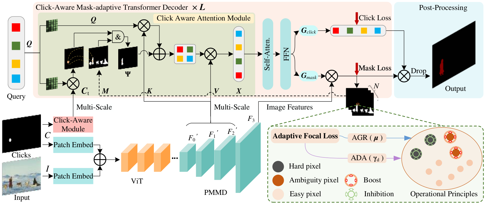

### 
 AdaptiveClick: Clicks-aware Transformer with Adaptive Focal Loss for Interactive Image Segmentation
 

  Jiacheng&nbsp;Lin</a> <b>&middot;</b>
  Jiajun&nbsp;Chen</a> <b>&middot;</b>
  <a href="https://yangkailun.com/" target="_blank">Kailun&nbsp;Yang</a> <b>&middot;</b>
  <a href="https://www.researchgate.net/profile/Alina-Roitberg-2" target="_blank">Alina&nbsp;Roitberg</a> <b>&middot;</b>
  Siyu&nbsp;Li</a> <b>&middot;</b>
  Zhiyong&nbsp;Li</a> <b>&middot;</b>
  Shutao&nbsp;Li</a>
     

  <a href="" target="_blank">Paper</a>

####

 

:hammer_and_wrench: :construction_worker: :rocket:

:fire: We will release code and checkpoints in the future. :fire:

 

### Update
- 2023.05.03 Init repository.

### TODO List
- [ ] Code release. 

### Abstract
Interactive Image Segmentation (IIS) has emerged as a promising technique for decreasing annotation time. Substantial
progress has been made in pre- and post-processing for IIS, but the critical issue of interaction ambiguity that notably hinders seg-
mentation quality, has been underresearched. To address this, we introduce ADAPTIVECLICK – a clicks-aware transformer incorporating
an adaptive focal loss, which tackles annotation inconsistencies with tools for mask- and pixel-level ambiguity resolution. To the best
of our knowledge, AdaptiveClick is the first transformer-based, mask-adaptive segmentation framework for IIS. The key ingredient of
our method is the Clicks-aware Mask-adaptive Transformer Decoder (CAMD), which enhances interaction between clicks and image
features. Additionally, AdaptiveClick enables pixel-adaptive differentiation of hard and easy samples in the decision space, independent
of their varying distributions. This is primarily achieved by optimizing a generalized Adaptive Focal Loss (AFL) with a theoretical
guarantee, where two adaptive coefficients control the ratio of gradient values for hard and easy pixels. Our analysis reveals that
the commonly used Focal and BCE losses can be considered special cases of the proposed AFL loss. With a plain ViT backbone,
extensive experimental results on nine datasets demonstrate the superiority of AdaptiveClick compared to state-of-the-art methods.

## Acknowledgement
Our project is developed based on [RITM](https://github.com/saic-vul/ritm_interactive_segmentation), [SimpleClick](https://github.com/uncbiag/SimpleClick) and [Mask2Former](https://github.com/facebookresearch/Mask2Former). Thanks for their excellence works.
